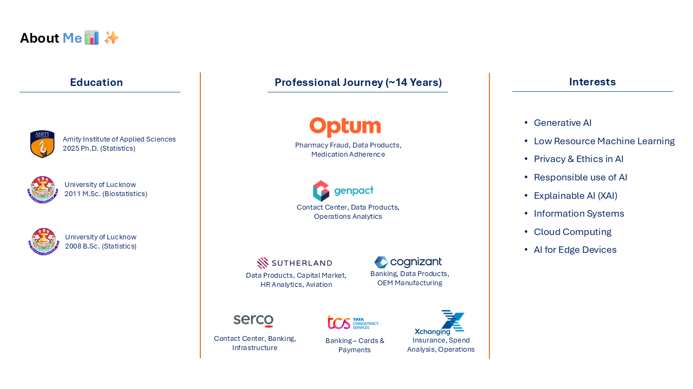

## 👨‍🏫 About the Instructor

**Dr. Anant Prakash Awasthi, PhD**  
*Data Science Educator | Solution Architect | GenAI & Ethical AI Enthusiast*

Dr. Anant Prakash Awasthi is a seasoned data science professional with over **14 years of experience** spanning technical, managerial, and strategic roles. Starting his journey in data analysis and machine learning, he has evolved into  **Solution Architect, People Manager, and Engagement Leader**, helping organizations design impactful, data-driven solutions across industries.

He has led projects in **supervised and unsupervised learning**, built AI-powered products, and mentored cross-functional teams. His expertise lies not only in designing advanced models but also in creating **responsible, explainable, and scalable AI systems**.

Currently, Dr. Awasthi is exploring the **cutting-edge realms of Cloud Computing**, **Generative AI**, **Low-Resource NLP**, and **Ethical AI**. He is passionate about building future-ready talent and frequently engages in **academic collaborations**, including **voluntary teaching roles at premier institutions** like IIT Patna.

As an educator, his focus is on **demystifying data science for diverse audiences** — making it accessible, applicable, and aligned to real-world challenges.

📍 Follow his work on  
🔗 GitHub: [github.com/anantawasthi](https://github.com/anantawasthi)  
🔗 LinkedIn: [linkedin.com/in/anantawasthi](https://www.linkedin.com/in/anantawasthi)

  

