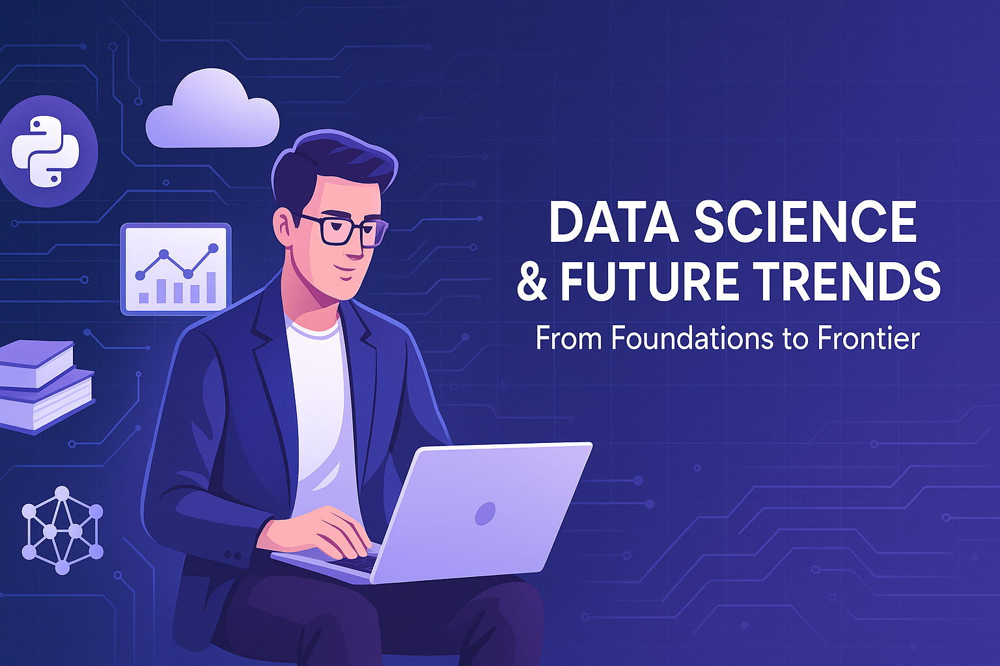

# **Data Science & Future Trends: From Foundations to Frontier**

Welcome to the official repository for the **🎓 Data Science and Future Trends** workshop — a **3-hour learning sprint** blending theory, hands-on skills, real-world tools, and emerging AI frontiers. Designed for budding minds in **Mathematics & Statistics**, this journey takes you from Python basics to Generative AI, with ethics and design thinking along the way!

  

---

## 🧭 **Workshop Roadmap**

### 🧠 **Part 1: Data Science, Technologies & Future Trends**

#### 🔍 1. What is Data Science?

- 📖 Definitions & Evolution

- 🔬 Interdisciplinary roots: Stats, CS, Domain Knowledge

- 💡 Applications: Finance, Healthcare, Manufacturing, EdTech

#### 🔄 2. Data Science Lifecycle

- ❓ Problem Framing

- 📦 Data Collection & Preparation

- 🤖 Modeling & Evaluation

- 🚀 Deployment & Monitoring

- 🔎 Optional Use Case: Churn Prediction / Credit Risk

#### ⚙️ 3. Tools & Technologies

- 🧰 Languages: Python, R, SQL, Spark

- 🧠 Libraries: Pandas, Scikit-learn, TensorFlow, PyTorch

- ☁️ Cloud: AWS (SageMaker), Azure, GCP

- 📊 Big Data: Hadoop, Hive, Spark

- 🔁 MLOps: MLflow, Docker, CI/CD

#### 📈 4. Market Trends

- 💼 Roles: Data Analyst, Data Scientist, ML Engineer

- 🏢 Adoption: BFSI, Pharma, Retail, SaaS

- 🌍 Citizen Data Scientists, Self-service BI

- 🕵️ Explainable AI & Responsible AI

#### 🔮 5. Future of Data Science

- 🤖 Generative AI & Foundation Models (GPT, Claude, Gemini)

- 🔁 Data-centric AI > Model-centric AI

- ⚒️ AutoML & Low-code AI

- 📜 Ethics, AI Regulation & Governance

- 🌐 Edge AI, Federated Learning, Graph AI

- 🎯 Human-in-the-Loop Systems

- 🌱 AI for Social Good & Sustainability

- 💼 Future Careers: AI Auditor, Prompt Engineer, Data Governance Expert

---

### 🛠️ **Part 2: Data Science & AI in Action**

#### 🗂️ 0. GitHub Fundamentals

Version control for Data Science projects using Git & GitHub

#### 📐 1. Methodologies & Solution Design

Best practices, modularity, reproducibility, stakeholder alignment

#### 🐍 2. Python Essentials

- 📊 Data Types & Conversions

- 🔁 Control Flow, Loops, Functions

- 📚 Data Structures & Libraries

- 🗃️ Standard Libraries: `os`, `datetime`, `shutil`

- 🧼 Data Management with Pandas

- 📊 Data Visualization with Matplotlib & Seaborn

#### 🧪 3. Building End-to-End DS Solutions

- 🌀 CRISP-DM

- 🕵️ Exploratory Data Analysis

- 🔍 Feature Engineering & Selection

- 📊 Dataset Splitting & Validation

#### 🤖 4. Machine Learning

- 📈 Supervised ML:
  
  - Linear & Logistic Regression
  
  - Case Studies: Churn, Sales, Risk

- 📉 Time Series Forecasting
  
  - Case Studies using ARIMA/RNN

- 🧩 Unsupervised ML: Clustering
  
  - KMeans & Hierarchical

- 💡 Case Studies across verticals

#### 🧠 5. Deep Learning

- 🔁 ANN, CNN, RNN Fundamentals

- 🧪 Use Cases:
  
  - Regression (ANN)
  
  - Classification (CNN)
  
  - Forecasting (RNN)
  
  - Image Processing

#### 🗣️ 6. Natural Language Processing (NLP)

- 📘 Key Terminologies

- 🧰 NLP Tasks: Tokenization, POS, NER

- 📚 Case Studies:
  
  - Text Classification
  
  - Sentiment Analysis

#### 🧬 7. Generative AI & LLMs

- 🧠 Foundation vs Small Language Models

- 📄 Build a Document Q&A System

- 🔎 Retrieval-Augmented Generation (RAG) Workflow

#### ⚖️ 8. Ethics & Fairness in AI

- ❗ Bias in AI Systems

- ⚖️ Fairness Metrics and Trade-offs

- 🧭 Global Frameworks & Guidelines

- 🕊️ Trust, Transparency & Explainability

- 🛡️ Responsible AI in Practice

---

## 📁 Folder Structure (Planned)

- `Part1_Theory`: Concepts, slides, market insights

- `Part2_HandsOn`: Notebooks, code, and solution walkthroughs

- `Notebooks`: Fully runnable use cases

- `Data`: Sample and synthetic datasets

- `Images`: Diagrams, charts, visual infographics

---

## 🎯 Who Should Use This?

- 🎓 UG/PG students in Mathematics & Statistics

- 💼 Professionals transitioning into Data Science

- 👨‍🏫 Educators looking for teaching material

- 🧠 Enthusiasts exploring AI, NLP, and GenAI

---

## 🧰 Tech Stack

- **Languages**: Python, SQL

- **Libraries**: Pandas, Scikit-learn, Matplotlib, Seaborn, TensorFlow, PyTorch

- **Visualization**: Seaborn, Plotly

- **Platforms**: Jupyter, Google Colab, Docker

- **GenAI**: HuggingFace, LangChain, OpenAI APIs

---

## 🚀 Getting Started

1. Clone this repo:  
   `git clone https://github.com/<your-username>/data-science-trends.git`

2. Navigate to the directory:  
   `cd data-science-trends`

3. Open notebooks in Jupyter or Colab

4. Start exploring from Part 1 or jump into code with Part 2

5. Don’t forget to check out the use cases in the **Notebooks** folder!

---

## 🙏 Acknowledgements

This repository is a free and open educational initiative.  
It is meant to **empower learners**, **enable educators**, and **encourage community-driven learning**.  
Feel free to fork, remix, teach from it, or build your own flavor of it.  
Special thanks to all students, collaborators, and open-source champions who made this possible. ❤️

---

## 📢 Stay Connected

⭐ Star this repo if you find it useful  
🔗 Share with your network  
💬 Connect with [Anant Prakash Awasthi](https://www.linkedin.com/in/anantawasthi) on LinkedIn for future updates and learning content

👨‍🏫 [About Instructor](about-me.md)

---

## 👐 Open Use Declaration

This content is **not licensed under any formal restriction**. It is truly **open** and **free to use** for academic, teaching, non-commercial, and community purposes. Attribution is appreciated but **not required**.

---
